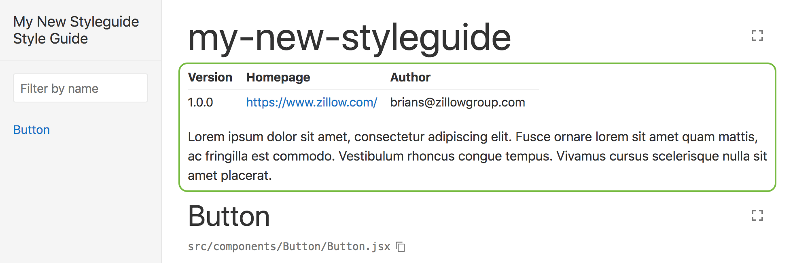
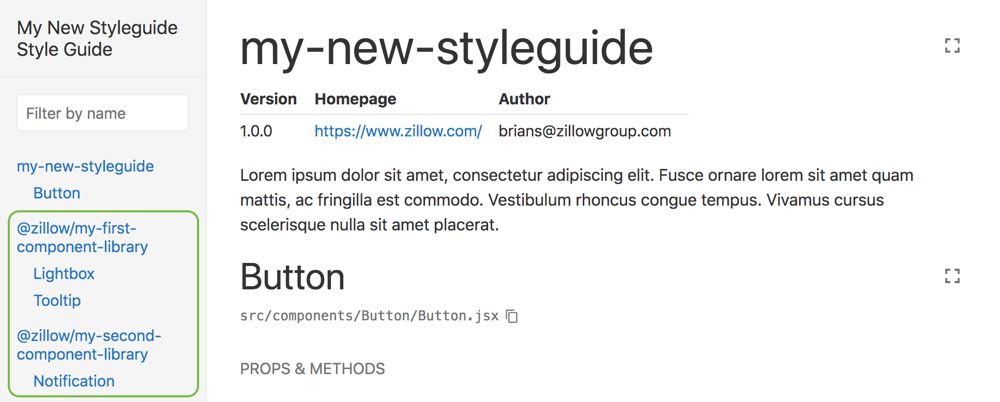

# create-react-styleguide

`create-react-styleguide` (a la [`create-react-app`](https://github.com/facebook/create-react-app)) is a tool for quickly generating style guides and component libraries. Generate your first project with the following command:

```
npx create-react-styleguide new my-new-styleguide
```

Projects are generated and configured with working style guide documentation. To view your new living style guide, run the following and visit http://localhost:6060:

```
cd my-new-styleguide && npm start
```

## npm scripts

Generated projects include the following npm scripts out of the box:

| Script    | Description |
| --------- | ----------- |
| npm start | Start the style guide server on http://localhost:6060 |
| npm run build | Build the component library to the `lib` folder |
| npm run build:watch | Watch the `src` folder for changes and run the build script |
| npm run build:styleguide | Build the style guide to the `styleguide` folder |
| npm run clean | Clean generated folders |
| npm run eslint | Run eslint on all .js and .jsx files in the `src` folder |
| npm run eslint:fix | Run eslint with the `--fix` option |
| npm test | Run unit tests |
| npm run test:watch | Run unit tests while watching for changes |
| npm run test:coverage | Run unit tests with code coverage |
| npm run test:update | Update unit test snapshots |

## Describe your styleguide with `STYLEGUIDE.md`

By default, we expose some meta data from your `package.json` file at the top of your style guide. At the very least, make sure you set the `"version"`, `"homepage"`, and `"author"` properties. You can further describe your library with an optional `STYLEGUIDE.md` file at the root of your project. This will be shown at the top of your living styleguide just below the `package.json` meta data. This additional information is super helpful when [linking multiple styleguides](#linking-multiple-styleguides).



## Adding SVG support

You can add SVG support with the [inline-react-svg](https://github.com/airbnb/babel-plugin-inline-react-svg) babel plugin. `npm i --save-dev babel-plugin-inline-react-svg` and then update your `.babelrc` file as follows:

```diff
 {
     "env": {
         "cjs": {
             "presets": ["zillow"]
         },
         "test": {
             "presets": ["zillow"]
         }
     },
     "presets": [["zillow", { "modules": false }]],
+    "plugins": ["inline-react-svg"]
 }
 ```

 You should now be able to import and use SVGs as if they were react components!

## Linking multiple styleguides

A useful feature of create-react-styleguide is the ability to link multiple CRS component libraries into a single project. This means that separate teams can manage and own their own individual CRS libraries, and then bring them all together into a master project for broader visibility.

For a styleguide to be linked, it must first be published to npm. Running `npm publish` will build and publish your component library so that it can be consumed by the master project.

From the master project, first install the published CRS module. Second, you will want to add a [crs.config.js](#crsconfigjs) file (if it does not already exist), and update the `styleguides` property to include the name of the module you just installed.

```javascript
module.exports = {
    styleguides: [
        '@zillow/my-first-component-library',
        '@zillow/my-second-component-library'
    ]
};
```

That's it! Running `npm start` will now show components from all linked libraries.



## crs.config.js

crs.config.js is an optional configuration file that can be added to the root of your project for further customization.

```javascript
module.exports = {
    // {array} An array of CRS npm modules (the module must be installed as a dependency to your project)
    styleguides: [
        '@zillow/my-first-component-library',
        '@zillow/my-second-component-library'
    ],
    // {array} An array of paths to be included by the babel-loader (`src` and `styleguidist` will be included by default).
    babelIncludes: [
         path.join(__dirname, 'path/to/folder')
    ]
};
```

## Under the covers

`create-react-styleguide` leverages [react-styleguidist](https://react-styleguidist.js.org/) under the covers for its living style guide.

Builds are created by simple running the `src` directory through [Babel](https://babeljs.io/) using whatever configuration is in your `.babelrc` file. The build will run twice, once with the default configuration which builds ES modules compatible with tree shaking, and once with the `"cjs"` env configuration which builds CommonJS modules.